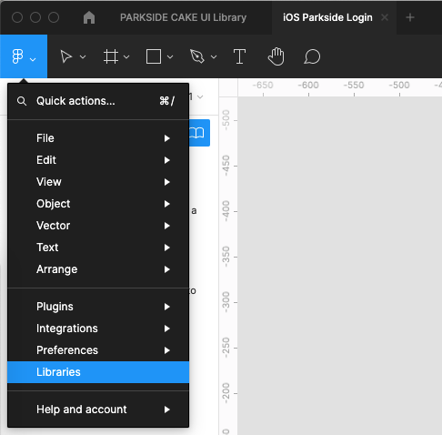
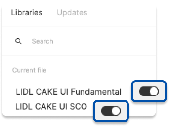

# Setup

CAKE UI Fundamental library is a rudimentary symbol library and has to be enabled first in Figma in order for all the other CAKE UI products to work (e.g. App, Chatbot, Web, Mail, … ).

---

## Figma

In order for you to be able to use the Fundamental and SCO libraries in your own Figma design file they have to be enabled first.

| Steps | Description | Preview |
|---|---|---|
| 1 | Open the top left Figma menu inside of a design file and choose "Libraries".  |  |
| 2 | Enable the libraries from the Figma “Assets” Panel (Shortcut Option + 3), search for the LIDL CAKE UI Fundamental and LIDL CAKE UI SCO libraries and enable them with the toggle switch. | |

### Download Figma libraries

LIDL CAKE UI Fundamental and LIDL CAKE UI SCO libraries are available on our GitHub. Download them and publish them inside your Figma account. Enable the libraries in your working file to use them.

[Figma library - LIDL CAKE UI Fundamental](https://github.com/cake-hub/lidl-figma/raw/master/LIDL%20CAKE%20UI%20Fundamental.fig)

[Figma library - LIDL CAKE UI SCO](https://github.com/cake-hub/lidl-sco-figma/raw/master/LIDL%20CAKE%20UI%20SCO.fig)
